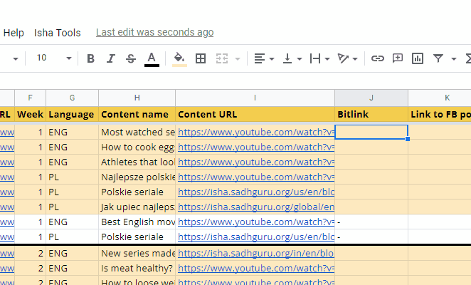

# Project title

short description what it is.

 

## Usage

### Provide groups & content

### Generate the calendar (the Schedule)

### Use functions & share data between spreadsheets easily!

## Installation

## Other
- How to create nice README files
  - https://carbon.now.sh/ - make pictures of your code
  - https://shields.io/ - get interactive banners like github download count, ready to add to github
  - https://github.com/matiassingers/awesome-readme - examples of good readmes

- Writing in Markdown tutorial
  -https://www.youtube.com/watch?v=eJojC3lSkwg
