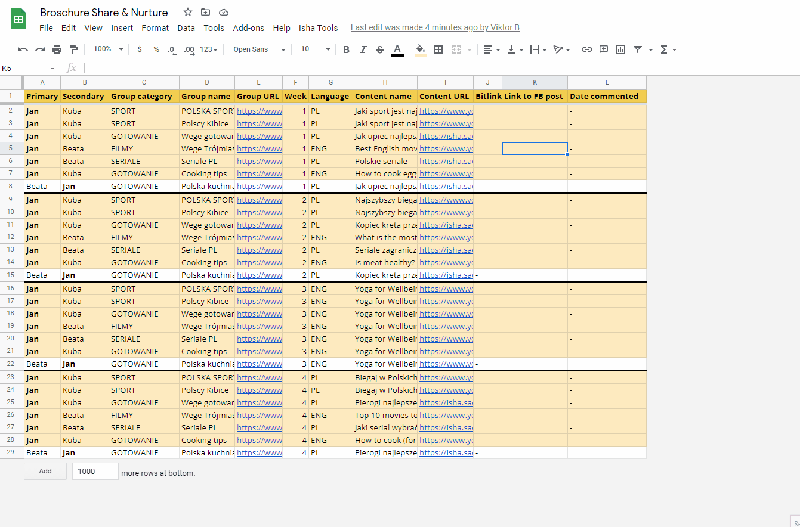

# Project title

Content Scheduler is an extension for Google Spreadsheets used for creating posting schedules for a Team of people.

## Usage

Content Scheduler can be used for:
  - generating a posting calendar for X weeks ahead
  - creating bitly links from content url's
  - sharing the posted link between sheets, the commenting person does not have to search for the links
  - managing who has access to the spreadsheet, and what actions can be made by them
  - updating groups in case someone is removed

Below are some examples:

- sharing a FB post between two sheets

 

- creating a bitlink from a youtube link

- marking a group for deletion

- replacing a posting person

## Installation

## Other
- How to create nice README files
  - https://carbon.now.sh/ - make pictures of your code
  - https://shields.io/ - get interactive banners like github download count, ready to add to github
  - https://github.com/matiassingers/awesome-readme - examples of good readmes

- Writing in Markdown tutorial
  -https://www.youtube.com/watch?v=eJojC3lSkwg
